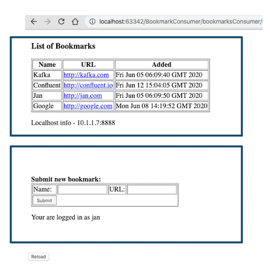
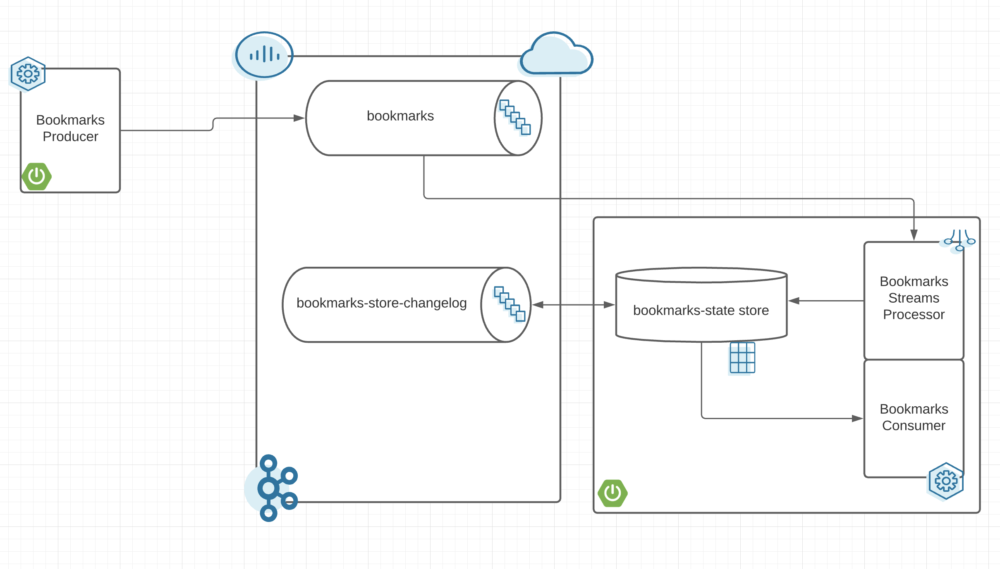

# Building Microservices with Apache Kafka as Service in Cloud

Demo application to demonstrate building microservices using Springboot and Apache Kafka. Application is a simple Bookmarks manager. It allows you to:
* Create a new bookmark
* Update a bookmark 
* Delete a bookmark
* All bookmarks are stored with some username
* Read list of bookmarks for some user



This demo consist of two microservices which are using Java Springboot:
* Bookmarks Producer - is used to send messages to Kafka
* Bookmarks  Consumer - is used to retrieving messages from Kafka and storing them in local  state store. 

Demo Application architecture


## Requirements to run it locally:
* Java 8
* Maven
* Connectivity to Confluent Cloud

## Create topics in Confluent Cloud
You need to create following 3 topics. Please use multiple partitons to demonstrate Microservices scaling. I usually use 6 partitions in my demo.
```
bookmarks
bookmarks-store-repartition
bookmarks-store-changelog 
```
* create topic "bookmarks" in Confluent Cloud. For future scaling purposes I recommend to create a topic with 3 or more partitions. This is a topic that will store all incoming bookmarks events.
* create topics "bookmarks-store-repartition" and "bookmarks-store-changelog" in Confluent Cloud. These topics will be used by Kafka Streams. These topics must have the same number of partitions as your "bookmarks" topic.

## Start the Producer
Start the Producer microservices with your properties file
```bash
cd BookmarksProducer
mvn spring-boot:run -Dspring.config.location=application.properties
```

## Test the Producer
Open your favorite browser and enter following url (assuming you have not changed the port 8080 in your properties file)

http://localhost:8080/bookmarksProducer/jan

Congrats you are logged in as a user "jan". You can change the name to anything you want. Bookmark events will be stored in the bookmarks topic in Kafka using this key! This means that all bookmark events from the same user will use the same partition.

## Start the Consumer
Start the Consumer microservices with your properties file
```bash
cd BookmarksConsumer
mvn spring-boot:run -Dspring.config.location=application.properties
```

## Test the Consumer
Open your favorite browser and enter following url (assuming you have not changed the port 8090 in your properties file)

http://localhost:8090/bookmarksConsumer/jan

Congrats you are logged in as a user "jan". Now you can view all the bookmarks that were stored as a user "jan". Change the name to be able to see bookmarks from some other users (if they exist).

## All Commands

### All WEB URL commands 
  * Publish new bookermakrs for some user
http://localhost:8080/bookmarksProducer/jan  
  * Get bookmarks for some user from the current container
http://localhost:8090/bookmarksConsumer/jan
  * Get bookmarks for some user from all containers
http://localhost:8090/bookmarksConsumerAll/jan
  * Get all currently available State Store containers
http://localhost:8090/processors

### Additional REST URL commands
  * Get host IP of the current container
http://localhost:8090/currentHost
  * Get all values for some user from the current container
http://localhost:8090/bookmarks/jan
  * Get host IP of the key store for some key
http://localhost:8090/keyHost/janGoogle
  * Get value of some key from the current container
http://localhost:8090/getOneBookmark/janGoogle

## Proxy Microservice
This microservice can be deployed to help to redirect to proper Consumer microservice which stores date for some key

### Proxy Microservice REST command
  * Get value of some key. Proxy will redirect to the correct Pod automatically
http://proxy.localhost/getOneBookmark/janGoogle

## Stop the demo showcase
Hit Control+C to stop any microservice.


